# მომხმარებლის აუთენთიკაცია Firebase_ის დახმარებით

ამ აპლიკაციაში ჩვენ შევძლებთ:
 - დავარეგისტრიროთ მომხმარებელი
 - გავუგზავნოთ მომხმარებელს ვერიფიკაციის ლინკი
 - 'დავალოგინოთ' მომხმარებელი
 - შევამოწმოთ არის თუ არა მომხმარებელი ვერიფიცირებული

აპლიკაცია შედგება ორი ეკრანისაგან:
 - Sign Up ეკრანი 
 - Sign In ეკრანი

## Firebase_ის პროექტი

სანამ AppInventor_ში აპლიკაციის შექმნას დავიწყებთ, შევქმნათ Firebase პროექტი

მიყევი სურათებზე მოცემულ პროცესს რის შემდეგაც ჩვენ:
 - შევქმნით პროექტს Firebase_ში
 - დავამატებთ Authentication სერვისს
 - მოვიპოვებთ API key_ს, რომლის დახმარებით შევძლებთ დავაკავშიროთ AppInventor_ისა და Firebase_ის პროექტები

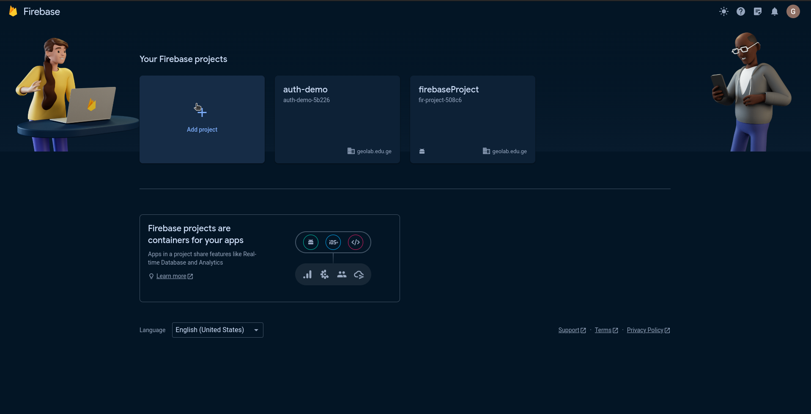
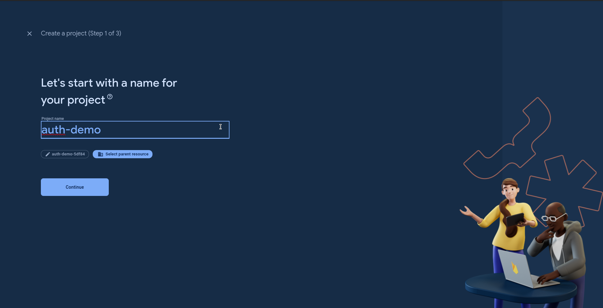
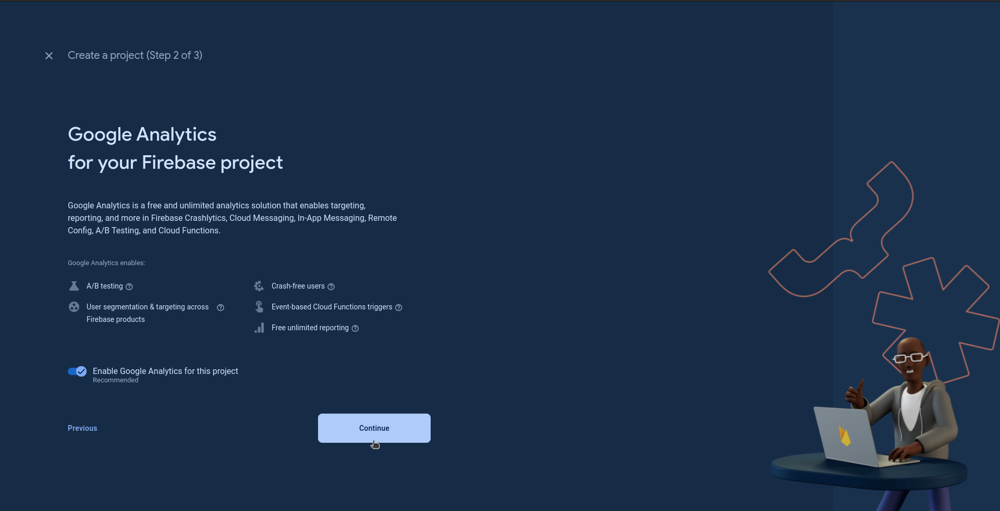
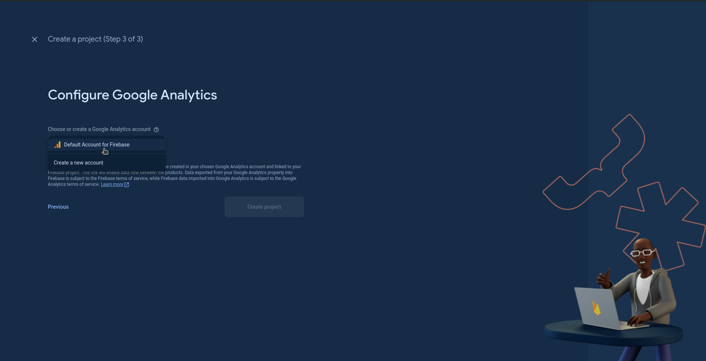
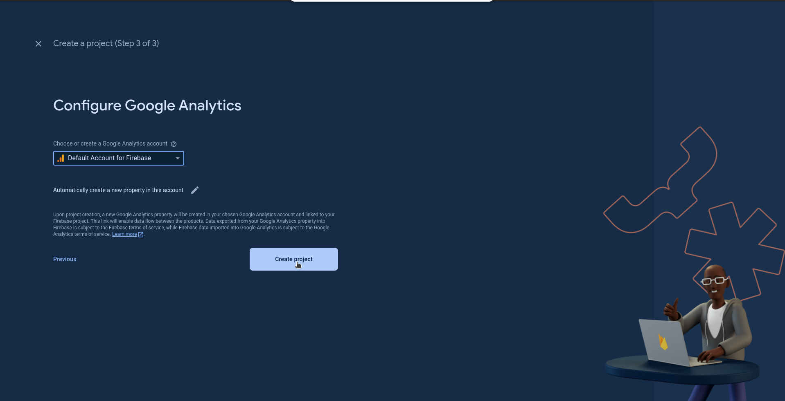
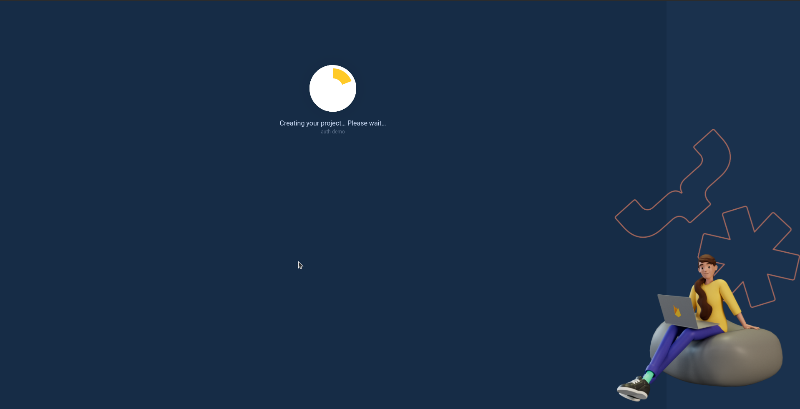
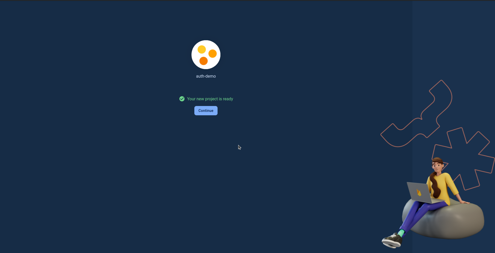
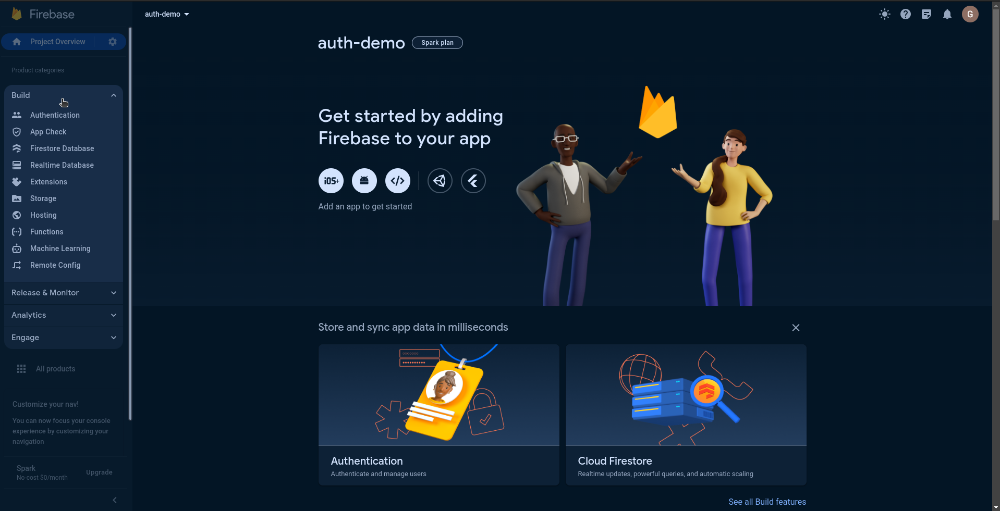
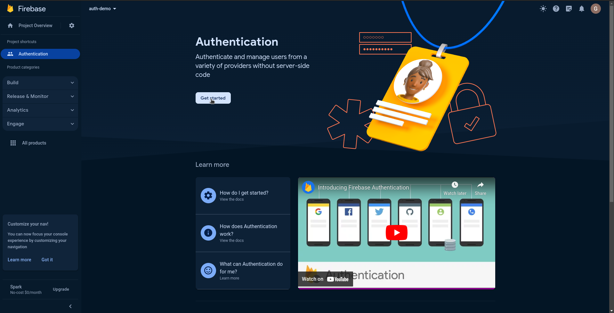
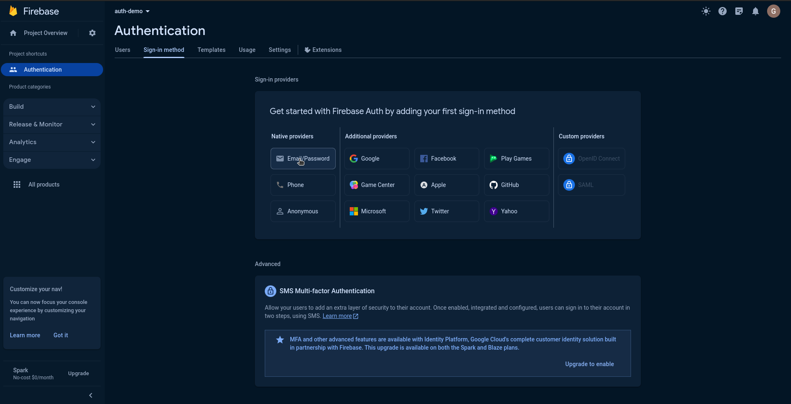
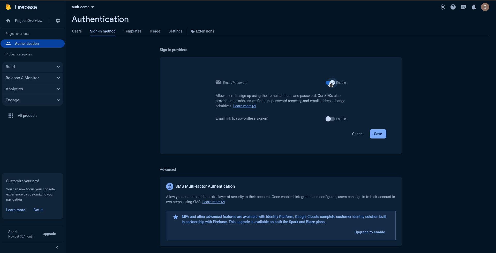
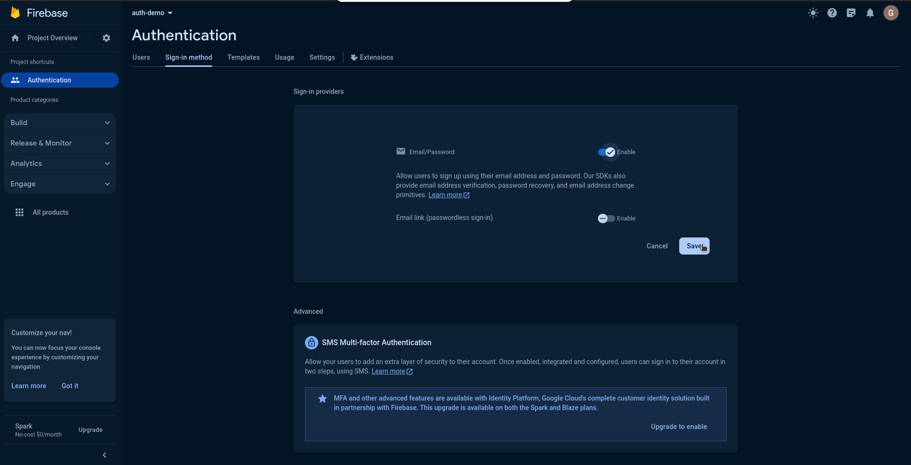
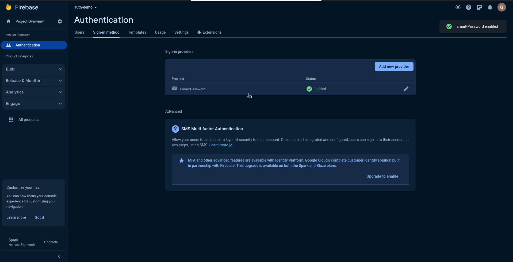
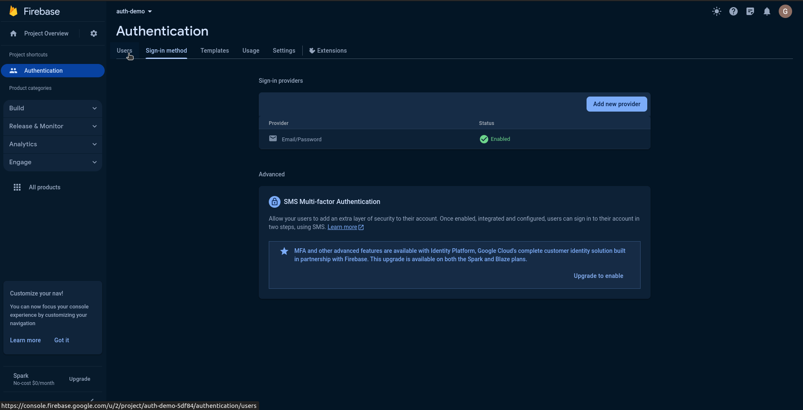

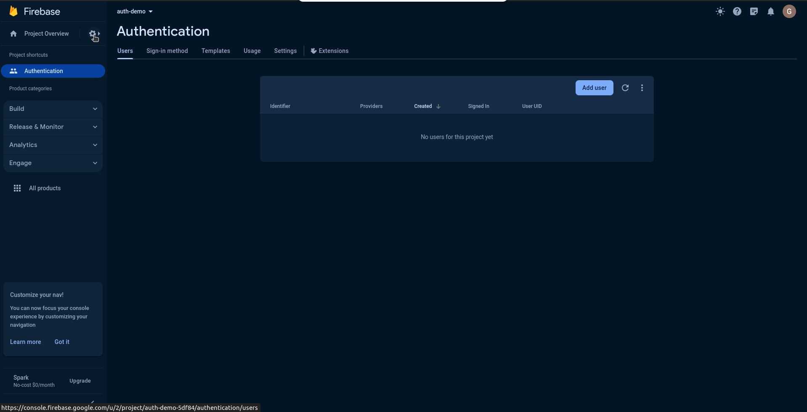
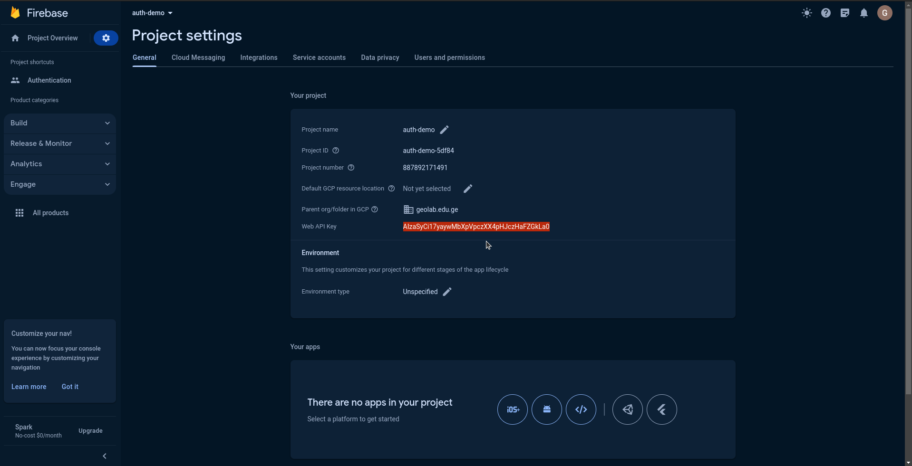

## მომხმარებლის რეგისტრაციის ეკრანის დიზაინი
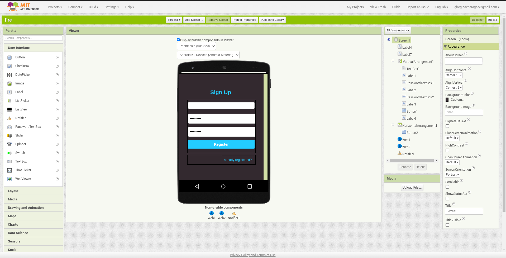
ამ ეკრანზე მოცემული ყველა კომპონენტი შენთვის ცნობილია, გარდა Web კომპონენტებისა, რომელიც Connectivity კომპონენტების ჩამონათვალში შეგიძლია იპოვნო

## მომხმარებლის რეგისტრაციის ეკრანის ბლოკები
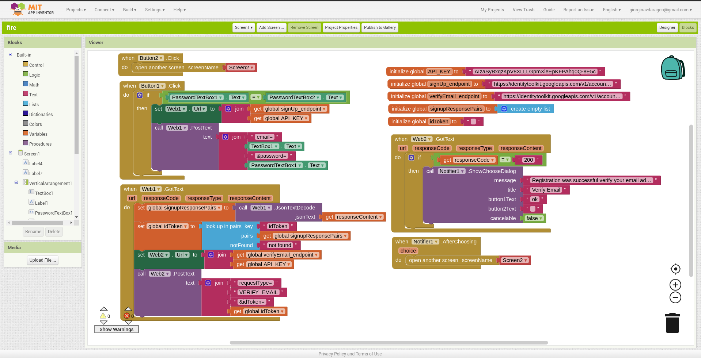

## მომხმარებლის აუტორიზაციის (Login) ეკრანის დიზაინი
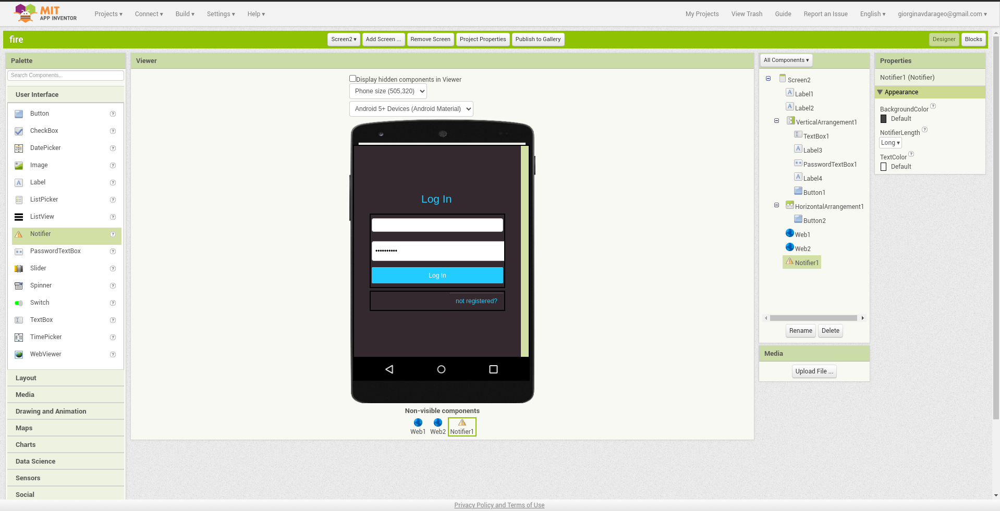

## მომხმარებლის აუტორიზაციის (Login) ეკრანის ბლოკები
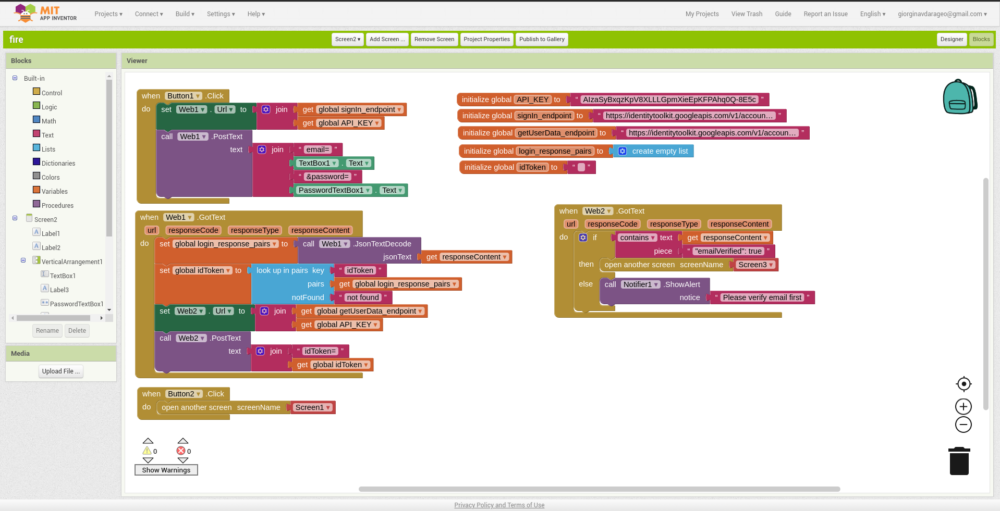

