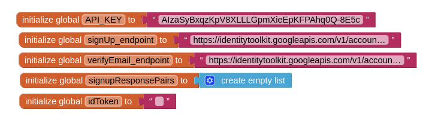
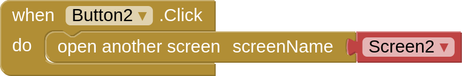
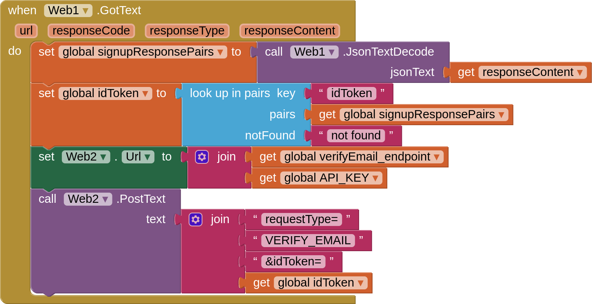
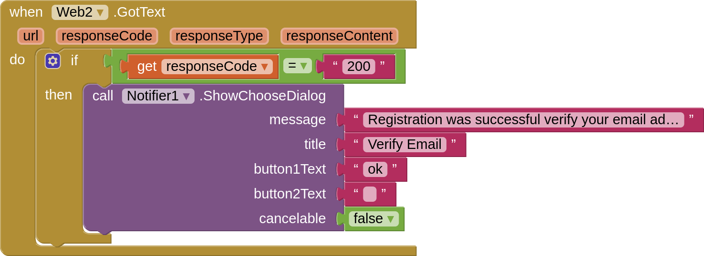

# მომხმარებლის აუთენთიკაცია Firebase_ის დახმარებით

ამ აპლიკაციაში ჩვენ შევძლებთ:
 - დავარეგისტრიროთ მომხმარებელი
 - გავუგზავნოთ მომხმარებელს ვერიფიკაციის ლინკი
 - 'დავალოგინოთ' მომხმარებელი
 - შევამოწმოთ არის თუ არა მომხმარებელი ვერიფიცირებული

აპლიკაცია შედგება ორი ეკრანისაგან:
 - Sign Up ეკრანი 
 - Sign In ეკრანი

## Firebase_ის პროექტი

სანამ AppInventor_ში აპლიკაციის შექმნას დავიწყებთ, შევქმნათ Firebase პროექტი

მიყევი სურათებზე მოცემულ პროცესს რის შემდეგაც ჩვენ:
 - შევქმნით პროექტს Firebase_ში
 - დავამატებთ Authentication სერვისს
 - მოვიპოვებთ API key_ს, რომლის დახმარებით შევძლებთ დავაკავშიროთ AppInventor_ისა და Firebase_ის პროექტები

## მომხმარებლის რეგისტრაციის ეკრანის დიზაინი

ამ ეკრანზე მოცემული ყველა კომპონენტი შენთვის ცნობილია, გარდა Web კომპონენტებისა, რომელიც Connectivity კომპონენტების ჩამონათვალში შეგიძლია იპოვნო

## მომხმარებლის რეგისტრაციის ეკრანის ბლოკები

 
პირველ რიგში შევქმენით რამდენიმე ცვლადი, რომლებშიც ვინახავთ:
 - Firebase პორექტიდან 'წამოღებულ' Api key_ს
 - Sign UP endpoint_ს(მისამართს) [Sign up with email / password](https://firebase.google.com/docs/reference/rest/auth#section-create-email-password)
 - Verify email endpoint_ს(მისამართს) [Send email verification / password](https://firebase.google.com/docs/reference/rest/auth#section-send-email-verification)
 - Sign Up მოთხოვნიდან დაბრუნებულ 'პასუხს'
 - მომხმარებლის idToken, რომელსაც მოთხოვნიდან დაბრუნებული პასუხიდან 'ამოვიღებთ'

 
იმ შემთხვევაში თუ მომხმარებელი უკვე დარეგისტრირებულია მას შეუძლია გადავიდეს Sign In ეკრანზე

 
რეგისტრაციის ღილაკზე დაჭერისას ჩვენ:
 - ვამოწმებთ თუ მომხმარებლის მიერ შეყვანილი password და confirm password ემთხვევა ერთმანეთს
 - Web კომპონენტს ვანიჭებთ URL მნიშვნელობას (Sign Up endpoint + API_KEY)
 - ვაგზავნით მოთხოვნას რეგისტრაციაზე postText ბლოკის დახმარებით, რომელსაც გადავცემთ მომხმარებლის მეილსა და პაროლს

 
რეგისტრაციის მოთხოვნის გაგზავნის შემდეგ გვიბრუნდება 'პასუხი' GotText ბლოკში responseContent პარამეტრის სახით.
ამის შემდეგ ჩვენ:
 - jsonDecodeText ბლოკის დახმარებით ცვლადში ვინახავთ ინფორმაციას სიის სახით, სადაც ყოველი ელემენტი არის ინფორმაციის სახელი(გასაღები) და მნიშვნელობის წყვილი
 - look up in pairs(Lists ბლოკებიდან) ბლოკის დახმარებით ვპოულობთ ინფორმაციას სახელით idToken და ამ მნიშვნელობას ვინახავთ შესაბამის ცვლადში
 - შემდეგ ვამზადებთ მეორე მოთხოვნას და Web2 კომპონენტის URL მნიშვნელობას ვანიჭებთ verify_email endpoint_ს და API_KEY_ს
 - Web2 კომპონენტის PostText ბლოკის დახმარებით მომხმარებელს ვუგზავნით ვერიფიკაციის ლინკს მითითებულ მეილზე

 
Web2 კომპონენტის GotText ბლოკში ვამოწმებთ პასუხის კოდს.(Response Code 200 პროგრამირებაში წარმატებულ request_ს აღნიშნავს) თუ კი მოთხოვნა წამრატებით გაიგზავნა და პასუხიც 'წარმატებულია' მომხმარებელს ვატყობინებთ ამის შესახებ Notifier ის დახმარებით. ამის შემდეგ მომხმარებელმა უნდა შეამოწმოს მეილი და გადავიდეს ვერიფიკაციის ბმულზე. რის შემდეგაც მომხმარებელი შეძლებს 'დალოგინებას'

## მომხმარებლის აუტორიზაციის (Login) ეკრანის დიზაინი

## მომხმარებლის აუტორიზაციის (Login) ეკრანის ბლოკები

 

Firebase_ზე Sign In მოთხოვნა იდენტურია რეგისტრაციის(Sign Up) მოთხოვნის. ერთადერთი განხვავება არის endpoint_ი რომელიც შესაბამის ლინკზე შეგიძლიათ დააკოპიროთ
[Sign in with email / password](https://firebase.google.com/docs/reference/rest/auth#section-sign-in-email-password)

იმისათვის რომ შევამოწმოთ მომხმარებელი არის თუ არა ვერიფიცირებული შეგვიძლია გავაგზავნოთ კიდევ ერთი მოთხოვნა
[Get user data](https://firebase.google.com/docs/reference/rest/auth#section-get-account-info)

ამ მოთხოვნისათვის ჩვენ გვჭირდება მომხმარებლის idToken_ი რომელსაც 'Sign in with email / password' მოთხოვნის პასუხში ვპოულობთ მსგავსად რეგისტრაციის ბლოკებისა

შემდეგ კი ვადგენთ ახალ მოთხოვნას Web2 კომპონენტში

ამ უკანასკნელი მოთხოვნის პასუხი შედარებით კომპლექსურია, თუმცა ჩვენ არ გვჭირდება ამ ინფორმაციის დამუშავება.
ერთადერთი გვაინტერესებს ეს ტექსტი თუ შეიცავს ("emailVerified": true) ტექსტს.
თუ ეს ასეა მომხმარებელს გადავიყვანთ ჩვენი აპლიკაციის მთავარ გვერდზე. წინააღმდეგ შემთხვევაში კი Notifier კომპონენტის დახმარებით ვამცნობთ, რომ საჭიროა მეილის ვერიფიცირება.
